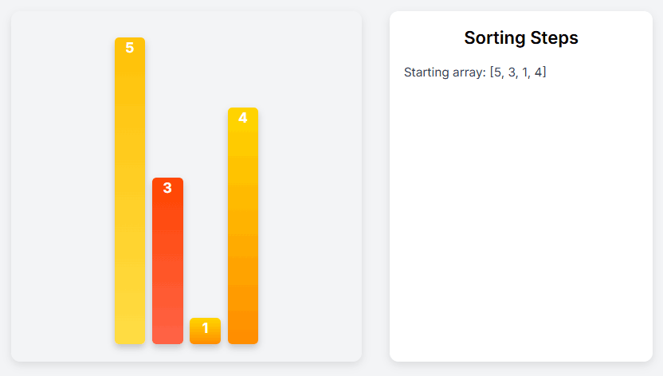

# AlgoViz: A Web Application for Interactive Algorithm Visualization

## Overview

The objective of this project is to develop an educational platform that provides lessons on topics related to data structures and algorithms, including binary search trees, sorting and searching algorithms, and graph traversal. The platform will utilize visualizations to illustrate the movement of inputs, display the code being executed, explain what happens at each step, and provide brief information about each specific algorithm, along with coding challenges to test your knowledge.

- **Binary Search Trees**
- **Sorting and Searching Algorithms**
- **Graph Traversal**

By utilizing visualizations, the platform aims to:

- Illustrate the movement of inputs.
- Display the corresponding code being executed.
- Explain each step in the algorithm.
- Provide concise information about specific algorithms.

## Features

### Frontend

- **Responsive and Interactive UI**: A user-friendly interface for algorithm visualization.
- **Modern Design**: Cross-browser compatibility with a clean and intuitive layout.

### Backend

- **API Development**: Enables communication between the frontend and backend.
- **Security**: Validates user inputs and ensures secure data handling.

### Fullstack Integration

- **Project Management**: Oversees coordination between frontend and backend development.
- **Version Control**: Implements GitHub for collaboration and documentation.
- **Scalability**: Ensures the application is robust and future-proof.
- **Security Measures**: Guarantee the safety of users by hashing their passwords and validating their inputs.

## Technology Stack

- **Frontend**: HTML, CSS, JavaScript, and modern UI frameworks (React or similar).
- **Backend**: Node.js, Express.js.
- **Database**: Firebase Realtime Database.
- **Version Control**: Git and GitHub.

## Project Objectives

- Create a visually engaging platform to simplify complex algorithms.
- Develop a responsive, cross-browser compatible UI.
- Ensure secure and scalable backend functionality.
- Deliver a well-documented and maintainable codebase.

## Installation and Setup

### Prerequisites

- Node.js installed on your machine.
- A Firebase account with a configured project.

### Steps

Clone the repository:  
`git clone <repository-url>`

Navigate to the project directory:  
`cd algorithm-visualization`

Install dependencies:  
`npm install`

Set up Firebase:  
- Configure your Firebase Realtime Database.  
- Add your Firebase credentials to the `.env` and `firebase-service-account.json` file.

Start the development server:  
`npm start`

---

## Developers
**Lemuel Madriaga** [CS3101] 
**Clarence Zamora** [CS3102] 
**James Michael Magnaye** [CS3102]

## Acknowledgement 💟
This project would not have been possible without the guidance of Ms. Fatima Marie Agdon, MSCS, IT314 Instructor. Throughout this course, we learned from her, starting with the fundamentals and progressing to the point where we could build our own web application. Thank you for this semester, and I hope to have the privilege of being one of your students again in the future.
